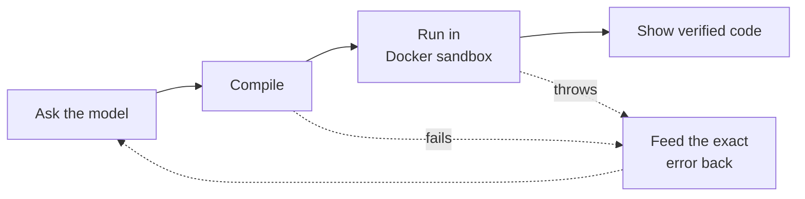
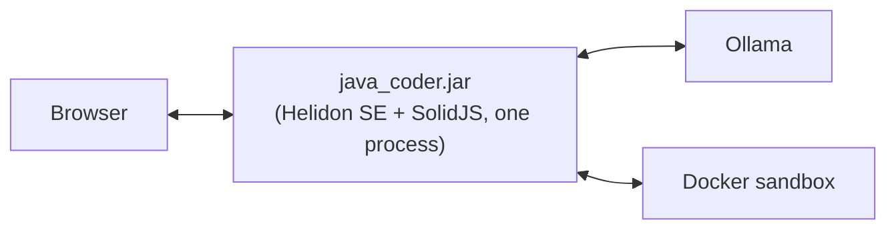

# JavaCoder

A local, self-hosted coding assistant that doesn't just generate Java — it proves the code works before showing it to you.

<p align="center"> 
    
</p>

Most LLM coding assistants stop at "here's some code that looks plausible." JavaCoder treats that as the starting point, not the answer: every class it generates gets compiled, checked for a real entry point, and actually executed in a sandboxed container. If it fails, the compiler error or stack trace goes straight back into the conversation and the model gets another shot — up to three times — before you ever see the result. No API keys, no cloud calls: everything runs against a local Ollama model on your own machine.

## Why this exists

Chat-based code generation has an obvious failure mode: the model is confident and the code doesn't compile. Fixing that by hand defeats the point of asking an assistant in the first place. The idea behind JavaCoder was to close that loop automatically — give the model a real compiler and a real (disposable) machine to run its own code on, and let it read its own errors the same way a developer would.

## The generation loop

Each request goes through the same pipeline, and every step is streamed live to the UI so you can watch it work instead of staring at a spinner:



Up to three passes through that loop (`MAX_ATTEMPTS` in `GeneratorService`), and it's one continuous conversation, not isolated retries — the model sees exactly what it wrote and exactly why it failed each time. Programs that legitimately block on `Scanner`/`System.in` are recognized as a success, not a timeout, and stay live in an interactive terminal streamed over SSE so you can type input back to them.

## Architecture



Everything ships as one executable jar: a Helidon SE backend, an embedded H2 database, and a SolidJS frontend built and bundled in at package time. There's no separate frontend server and nothing to deploy but the jar.

- **Backend** — Java 23, [Helidon SE](https://helidon.io/) for the webserver/SSE, [LangChain4j](https://github.com/langchain4j/langchain4j) wrapping Ollama for the model calls, H2 for persistence (chats, prompts, installed models).
- **Sandbox** — generated code runs inside a throwaway `eclipse-temurin:21-jre-alpine` container with no network access and hard CPU/memory/process limits, driven directly through the Docker CLI.
- **Model management** — ships lightweight by default (`llama3.2 3B`); other Ollama models can be browsed and installed from the UI and are pulled/registered automatically, no terminal required.
- **Frontend** — SolidJS + TypeScript, including a real interactive terminal component wired to the sandbox's stdin/stdout over SSE.

## A few things that were harder than expected

- **Telling "blocked on input" apart from "crashed."** A program waiting on `Scanner.nextLine()` and a program that hung look identical from the outside. The sandbox uses a timeout heuristic to distinguish the two, so interactive programs don't get incorrectly flagged as broken.
- **Bootstrapping Ollama with zero manual setup.** `OllamaSetupManager` detects the OS and handles install/extract/start/kill with the right mechanism for each platform (tar/zip extraction, PowerShell on Windows, process signals on Unix), so there's no "first install this, then that" step for the user.
- **No dependency injection.** Helidon SE is intentionally minimal, so wiring (DB manager, LLM config, etc.) goes through a small static context registry instead of a DI framework — a deliberate trade-off for a single-developer-sized codebase, called out directly in the source rather than hidden.

## Running it

Requires Java 23+ and Maven. [Docker](https://www.docker.com/products/docker-desktop/) is optional but recommended — without it, chat and code generation still work, only the sandbox verification step is skipped (with a clear message saying so).

```bash
mvn clean package
java -jar target/java_coder.jar
```

On first run, JavaCoder detects your OS, installs Ollama if it isn't already present, and pulls the default model in the background — there's nothing else to configure.
